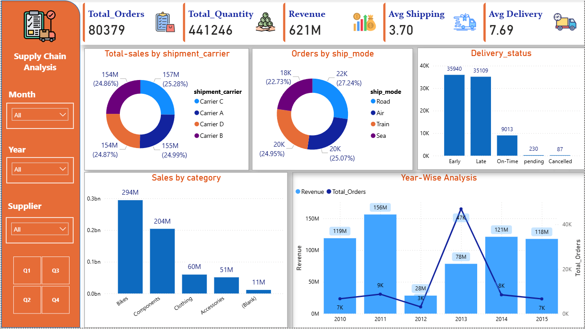
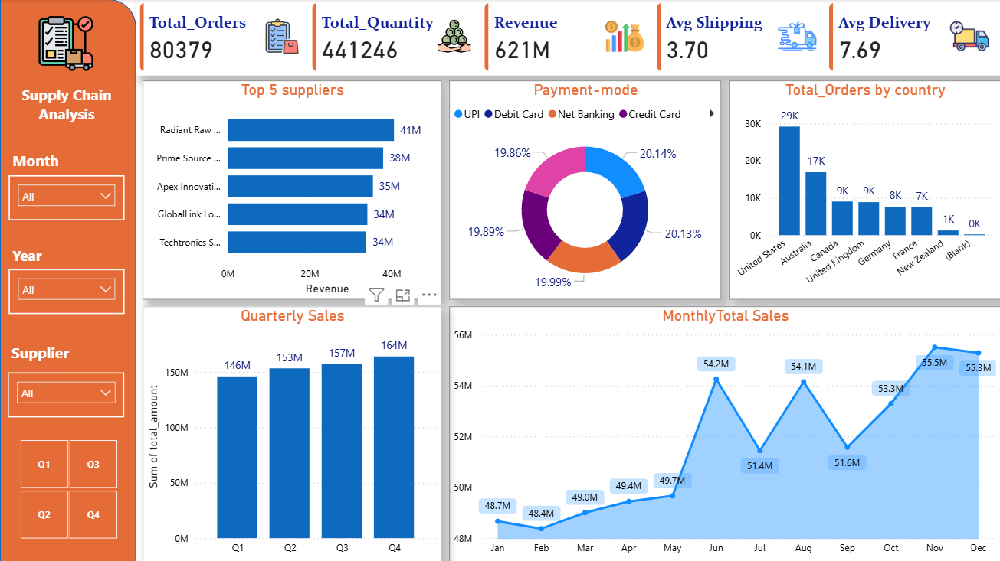

# 📦 Supply Chain Data Analysis Project (Python → SQL Server → Power bi)

This project demonstrates a complete supply chain analytics workflow — from raw product, sales, customer, and supplier data, through advanced SQL-based analysis, to insightful visualizations using Power bi.

---

## 🧰 Tools & Technologies Used

- **Data Source**: Synthetic supply chain datasets (sales, products, customers, suppliers)
- **Data Cleaning & Transformation**: Python (Pandas)
- **Database**: SQL Server
- **Data Analysis**: T-SQL (Window Functions, CTEs, Aggregations, Joins, Case Logic)
- **Visualization**:  Power BI,Python(Matplotlib)

---

## 📌 Project Workflow

### 🔹 Step 1: Data Preparation & Cleaning (Python)

- Cleaned and validated sales, customer, supplier, and product data
- Handled:
  - Null values and incorrect formats
  - Standardized delivery statuses and shipment labels
  - Converted date fields and created new metrics (e.g. delivery time)
  - Created new columns like,tracking_status,lead_time,shipping_time
  - Loaded the cleaned datasets into SQL Server
 
 📄 File: [`supply_chain_analysis.ipynb`](./supply_chain_analysis.ipynb)

### 🔹 Step 2: SQL-Based Business Analysis

Performed end-to-end supply chain performance analysis using SQL, including:

#### ✅ Supplier & Shipment Insights
- Most frequently used **shipment mode** and **carrier** by each supplier
- Supplier delivery success rates and **average delivery times**
- Suppliers contributing most to total revenue

#### ✅ Product Performance
- Total quantity sold by product
- High-margin and high-profit products
- Products with the highest **late delivery rate**

#### ✅ Customer & CLTV Insights
- Customers ranked by **lifetime value (CLTV)** using order count and total spend
- Identified customers who have **never placed an order**
- Customer order behavior and revenue contributions

#### ✅ Operational & Delivery Metrics
- Yearly revenue and order trends
- Peak order days by weekday
- Average delivery time by shipment carrier and ship mode

👉 Refer to [`supply_chain_1.sql`](./supply_chain_1.sql) and [`supply_chain_insights.sql`](./supply_chain_insights.sql) for full SQL logic.

### 🔹 Step 3: Dashboarding in Power bi

Built an interactive dashboard to visualize operational KPIs:

- **Yearly & Monthly Revenue Trends**
- **Delivery Status Distribution by Carrier**
- **Top Performing Products & Suppliers**
- **Shipment Mode Usage by Supplier**

  

👉 ## 🔗 View Power BI Dashboard

[Click here to view the interactive Power BI report]
(https://app.powerbi.com/view?r=eyJrIjoiM2UxMDJhZjMtNWIzZC00NjQ0LTlkMjktMjkyZDliOTgwYjk0IiwidCI6ImE2MGJiMDAwLTgyODEtNGE5Zi04NmFmLTA0Yjc3OTg1MGQxNiJ9)

## 🔍 Key Business Insights

- 📈 **Revenue peaked in June and November**, suggesting seasonal buying patterns.
- 🚚 **Road shipment** is the most used mode (~27%), but some carriers have low on-time rates.
- ⏰ Nearly **50% of deliveries** were either early or late — significant delivery inconsistency.
- 🏭 **Radiant Raw Materials** emerged as the highest-grossing supplier.
- 📦 **Bikes** category generated the highest revenue (₹294M).
- 💰 Several products delivered **high revenue but low profit margins** — highlighting pricing issues.
- 👤 Customers with high CLTV contribute significantly to revenue; some have never placed any orders.
- 📅 **Tuesdays and Wednesdays** were the peak ordering days with faster delivery times.

---

## 📁 Files in This Repository

| File Name                   | Description |
|-----------------------------|-------------|
| `supply_chain_analysis.ipynb` | Python notebook for data cleaning and EDA |
| `supply_chain_1.sql`         | SQL file for KPI and metric-based analysis |
| `supply_chain_insights.sql`  | SQL file for deep business insights (CTEs, window functions) |
| `sales.csv`                  | Raw sales data including dates and delivery statuses |
| `products.csv`               | Product details including cost and supplier info |
| `suppliers.csv`              | Supplier information |
| `customers.csv`              | Customer demographics and IDs |
| `supply_chain_overview.png`  | Dashboard overview screenshot |
| `supply_chain_summary.png`   | Visual summary of key KPIs |
| `README.md`                  | Project documentation file |

---

## ✅ Conclusion

This project delivers a detailed analysis of supply chain operations using structured data, powerful SQL logic, and meaningful visuals. It uncovers business-critical insights around delivery delays, supplier profitability, customer value, and shipping logistics — all essential for improving operational efficiency and strategic planning.
